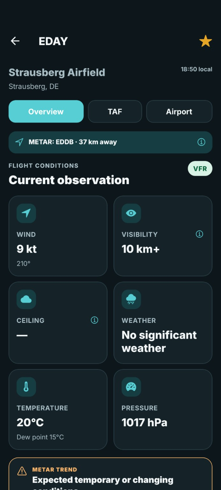
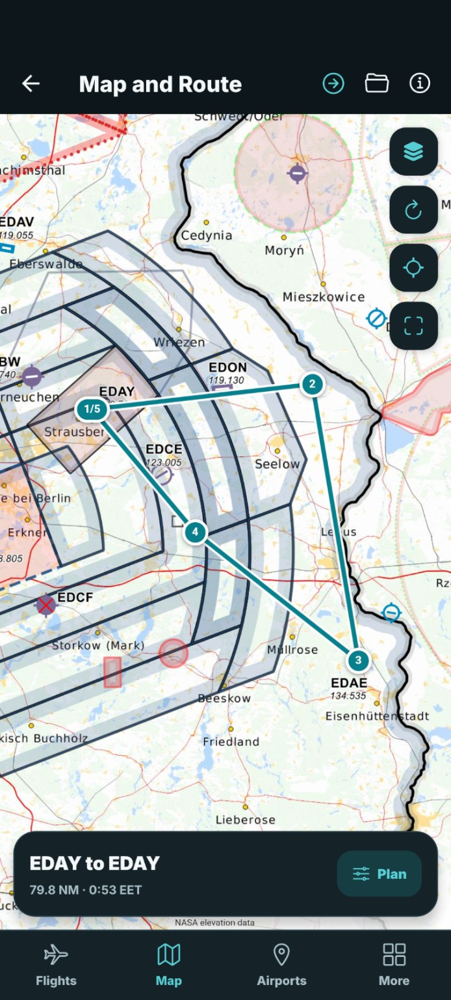
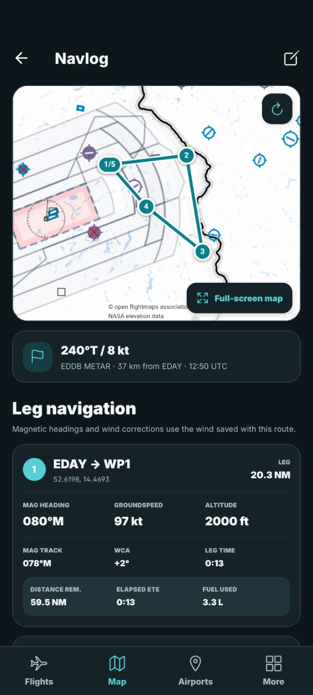
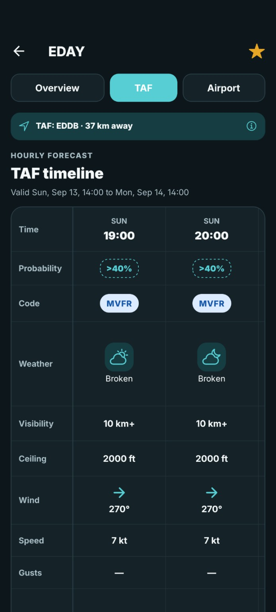
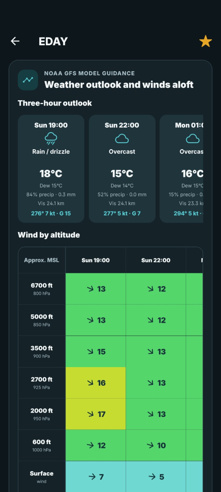
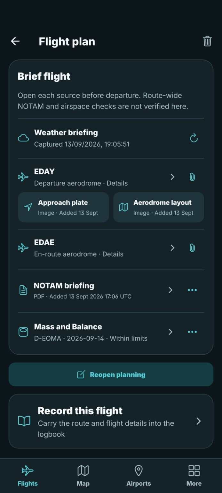
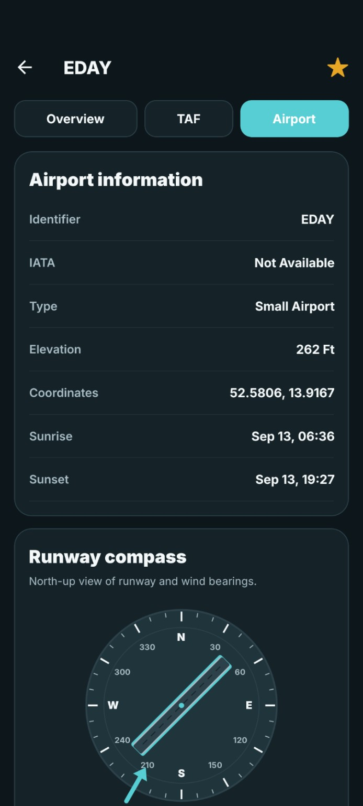
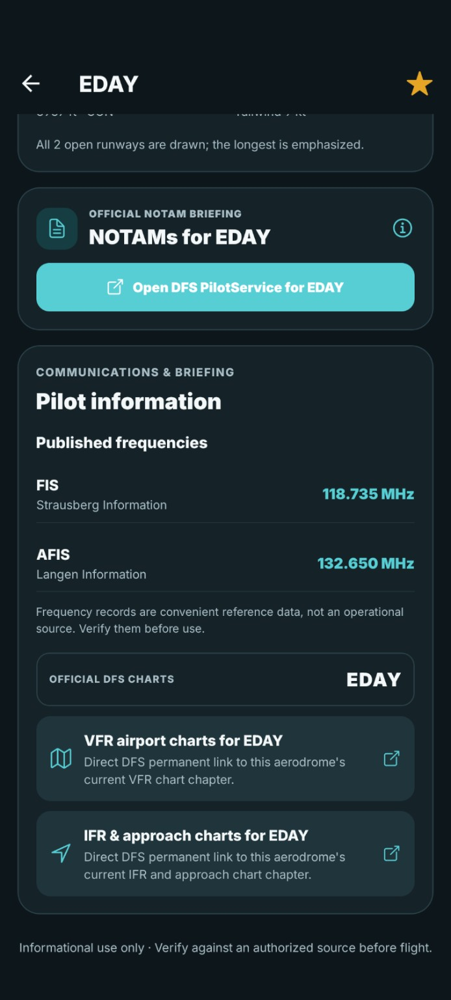
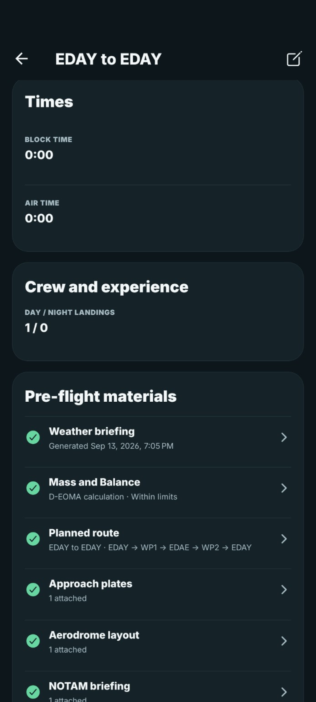

<p align="center">
  
</p>

<h1 align="center">AeroBrief</h1>

<p align="center">Weather, flight planning, and your flying records in one app.</p>

AeroBrief brings airport weather, route planning, pre-flight materials, a pilot logbook, and aircraft Mass and Balance together. Plan a flight, collect its briefing and documents, then carry the route and flight details into your logbook.

## Installation

<details open>
<summary><strong>Android</strong></summary>

1. Open this repository's [**Releases**](https://github.com/tanay1337/AeroBrief/releases) page.
2. Download the latest AeroBrief `.apk` file.
3. Open it on your Android device and allow installation from that source if Android asks.

Install an update over your existing AeroBrief app to retain local records.

</details>

<details>
<summary><strong>iOS</strong></summary>

The application source supports an iOS production export. A packaged iOS release is not currently provided; building for a device requires your own Apple signing setup.

</details>

## Screenshots

<table>
  <tr>
    <td align="center" width="33%">
      <strong>Weather and Airports</strong><br><br>
      
    </td>
    <td align="center" width="33%">
      <strong>Map and Route</strong><br><br>
      
    </td>
    <td align="center" width="33%">
      <strong>Navlog</strong><br><br>
      
    </td>
  </tr>
  <tr>
    <td align="center" width="33%">
      <strong>TAF timeline</strong><br><br>
      
    </td>
    <td align="center" width="33%">
      <strong>Winds aloft</strong><br><br>
      
    </td>
    <td align="center" width="33%">
      <strong>Flight briefing</strong><br><br>
      
    </td>
  </tr>
</table>

<details>
<summary><strong>More screenshots: flights, airports, and logbook</strong></summary>

<table>
  <tr>
    <td align="center" width="33%">
      <strong>Your flights</strong><br><br>
      
    </td>
    <td align="center" width="33%">
      <strong>Favorite airports</strong><br><br>
      
    </td>
    <td align="center" width="33%">
      <strong>Airport information</strong><br><br>
      
    </td>
  </tr>
  <tr>
    <td align="center" width="33%">
      <strong>Charts and NOTAMs</strong><br><br>
      
    </td>
    <td align="center" width="33%">
      <strong>Logbook</strong><br><br>
      
    </td>
    <td align="center" width="33%">
      <strong>Flight records</strong><br><br>
      
    </td>
  </tr>
</table>

</details>

## Features

- **Weather and Airports**: Decoded METAR observations, raw reports, flight-condition categories, favorites, and an hourly TAF timeline with forecast changes and probabilities. Airports without a local report show the nearby reporting station and its distance.
- **Forecast guidance**: A three-hour weather outlook and winds by altitude from NOAA GFS model guidance, plus DWD general weather warnings for German airports.
- **Airport reference**: Airport details, runways, a runway-and-wind compass, published radio frequencies, sunrise and sunset times, and official German chart and NOTAM briefing links.
- **Map and Route**: Aeronautical raster charts, optional satellite imagery, coordinate and nearby-airport waypoints, saved routes, and a full-screen map. Navlog legs show true and magnetic tracks, wind correction, headings, groundspeed, estimated time, optional fuel estimates, altitude, and notes.
- **Flight planning**: Quick plans, upcoming flights, reusable routes, captured weather briefings, Mass and Balance, and image/PDF attachments for approach plates, aerodrome layouts, and NOTAM briefings. Planning and briefing views keep each flight's materials together.
- **Pilot logbook**: Flight and aircraft totals, CSV/XLSX imports, CSV exports, draft entries, calculated block and air times, change history, and attached pre-flight materials. Carry a planned flight into the logbook when you are ready to record it.
- **Mass and Balance**: Configurable aircraft profiles, profile import/export, loading calculations based on your aircraft's numerical limits, and saved calculations that can stand alone or be linked to a flight or logbook record.
- **Pilot Documents**: Keep licence, medical, identity, and other document records with validity dates and attached images or PDFs. View files inside the app.

## Local records

Flights, settings, saved routes, aircraft profiles, and documents are stored on your device. AeroBrief does not require an AeroBrief account or provide a cloud-sync service. The airport reference database is bundled with the app. Live weather, online charts, and satellite imagery require an internet connection.

## Development

Built with **Expo, React Native, TypeScript, and SQLite**. Android is the primary release target.

Use Node.js 24, clone the repository, and run these commands from its root:

```sh
npm ci
npm run android
```

The app uses native SQLite, file access, and browser modules. Use an Android development build for testing.

<details>
<summary><strong>Validation and release builds</strong></summary>

```sh
npm run typecheck
npm run lint
npm test
npm run validate:data
npm run bundle:check
```

`bundle:check` exports the Android and iOS application bundles. It does not compile or sign a complete native app.

For hosted builds, configure your own Expo account and project. `eas.json` defines development, preview APK, and production app-bundle profiles. Keep release signing credentials outside the repository.

**Source build note:** The optional native location implementation is absent from this source package. The GPS hook handles its absence, but a fresh native build cannot establish location feature parity with previously distributed APKs. Version 0.16.0 packages the new production application bundle in the existing compatible native shell. New native functionality requires a full native build.

See [release verification](RELEASE_VERIFICATION.json) for the current release.

</details>

<details>
<summary><strong>Regenerating the airport database</strong></summary>

Download the public airport, runway, and frequency exports from [OurAirports](https://ourairports.com/data/), then run:

```sh
npm run generate:airports -- airports.csv runways.csv assets/airports.db airport-frequencies.csv
npm run validate:data
```

The bundled database contains public reference data only. User records and attachments are created separately in private app storage.

</details>

## Data sources

| Source | Used for |
| --- | --- |
| [NOAA Aviation Weather Center](https://aviationweather.gov/data/api/) | METAR and TAF reports |
| [Open-Meteo](https://open-meteo.com/en/docs/gfs-api) | NOAA GFS outlook and pressure-level wind guidance |
| [DWD](https://www.dwd.de/EN/ourservices/opendata/opendata.html) | General weather warnings for German airports |
| [OurAirports](https://ourairports.com/data/) | Public airport, runway, and frequency reference data |
| [OpenFlightMaps](https://openflightmaps.org/) | Online aeronautical raster charts |
| [Esri](https://www.arcgis.com/home/item.html?id=10df2279f9684e4a9f6a7f08febac2a9) | Optional satellite imagery |
| [DFS AIS](https://ais.dfs.de/) | Official German chart and NOTAM briefing links |

External services, maps, charts, and documents retain their own terms and are not relicensed with the application code. See [third-party notices](THIRD_PARTY_NOTICES.md).

## Current limitations

AeroBrief is experimental and is not certified for flight planning or navigation. It does not replace an authorized pre-flight briefing or a certified logbook. Keep your original records, review imports, and verify critical information against official sources.

Route-wide NOTAM and airspace checks are not verified. The route map displays raster charts rather than structured airspace analysis. METAR-based route wind correction uses surface wind, not winds aloft. Configure Mass and Balance from the approved, current aircraft flight manual, weighing report, or load sheet.

## Contributing

Bug reports and improvements are welcome. For a bug report, include your app version, device, steps to reproduce, and screenshots when useful. For a source change, run the checks above and explain the resulting behavior.

## License

[MIT License](LICENSE)
